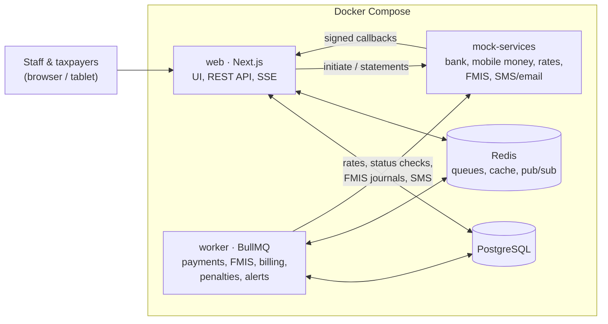

# IRCUB — Integrated Revenue Collection & Utility Billing Platform

Evaluation submission for the **Software Developer** role at Farsight Africa Technologies.

## 1. Overview

IRCUB automates tax revenue collection for a state **Ministry of Finance** and water billing for the **State Water Agency**, and posts every collection to the government **FMIS** (Financial Management Information System). Officers register payers, raise assessments and capture payments; banks and mobile money providers send signed payment notifications; the water agency reads meters and runs monthly billing; supervisors approve reversals and reconcile with the channels and FMIS; executives follow collections, targets and forecasts on a live dashboard. This repository contains the written answers to every part of the test and a working proof of concept (POC) of the platform, with all external systems simulated.

- **Every test question → its answer:** [ANSWERS.md](ANSWERS.md)
- **How each flow works, file by file:** [docs/how-it-works.md](docs/how-it-works.md)

## 2. Technology stack and why

| Area                  | Choice                                                          | Why                                                                                                                      |
| --------------------- | --------------------------------------------------------------- | ------------------------------------------------------------------------------------------------------------------------ |
| Language              | **TypeScript** (strict), Node.js 24                             | One language for UI, API, worker and tests; shared types and validation.                                                 |
| Web app + API         | **Next.js 16** (App Router), React 19                           | Server components read the database directly; server actions for forms; route handlers for partner APIs; one deployable. |
| Database              | **PostgreSQL 17**                                               | Transactions, `SKIP LOCKED`, window functions, partial/covering/BRIN indexes, partitioning, PL/pgSQL.                    |
| ORM / migrations      | **Prisma 7** + raw SQL                                          | Typed queries and migrations; raw SQL for window functions, locking, constraints and the penalty function.               |
| Queues, cache, events | **Redis 8 + BullMQ 5**                                          | Durable jobs with retries/backoff/dedupe; cache-aside; pub/sub for live updates; rate limiting.                          |
| Auth                  | **Auth.js v5** credentials, **argon2id**, optional **TOTP** 2FA | Standard, secure session handling; strong hashing; 2FA.                                                                  |
| UI                    | **Tailwind CSS**, shadcn/ui-style components, **Recharts**      | Accessible, tablet-friendly screens with little code.                                                                    |
| Forms / validation    | **React Hook Form + Zod**                                       | The same Zod schema validates in the browser and on the server.                                                          |
| Files                 | papaparse (CSV), pdfkit (PDF), qrcode (QR on bills)             | Small, well-known libraries.                                                                                             |
| Real time             | **Server-Sent Events**                                          | One-way live updates over plain HTTP.                                                                                    |
| Tests                 | **Vitest**, **Playwright**, **k6**                              | Unit + integration, E2E (desktop and tablet), load.                                                                      |
| API docs              | **OpenAPI 3** + Swagger UI, Postman                             | Contract for bank / mobile money integrators.                                                                            |
| Runtime               | **Docker Compose**, pnpm workspaces                             | One command to run everything.                                                                                           |

Detailed trade-offs: [docs/architecture.md](docs/architecture.md#3-technology-choices). Version choices (e.g. BullMQ 5 rather than the brand-new 6): [answers/00-assumptions.md](answers/00-assumptions.md#a-technology).

## 3. Architecture



More diagrams (payment sequence, FMIS posting, billing cycle, reversals): [docs/architecture.md](docs/architecture.md). Database: [docs/erd.md](docs/erd.md).

## 4. Folder structure

```
.
├── answers/            Written answers, one file per test part (+ 00-assumptions.md)
├── sql/                Part 1 SQL answers as runnable, idempotent .sql files
├── apps/
│   ├── web/            Next.js app: app/ (routes only), modules/<area>/ (components, services,
│   │                   schemas, actions), lib/ (auth, rbac, db, redis, logger), components/
│   ├── worker/         BullMQ jobs: payments, FMIS posting, billing, penalties, summaries,
│   │                   alerts, status checks, notifications, rates, maintenance
│   └── mock-services/  Simulated bank, mobile money, exchange rates, FMIS, SMS/email
├── packages/
│   ├── core/           PURE business logic + unit tests (tariff, penalty, validation, HMAC,
│   │                   journals, regression, control numbers, duplicates, RBAC ...)
│   ├── db/             Prisma schema, migrations, audit writer, seed and perf-data scripts
│   └── platform/       Logger, Redis, queues, cache, events, rate limiter (web + worker)
├── docs/               erd.md, architecture.md, how-it-works.md, api/ (OpenAPI, Postman, examples)
├── tests/
│   ├── integration/    Vitest against a real PostgreSQL + Redis (ircub_test database)
│   ├── e2e/            Playwright (desktop + tablet) and API contract tests
│   └── load/           k6 script: 5,000 payments per minute
├── scripts/            send-signed.mjs (call the channel APIs with a valid HMAC signature)
├── docker-compose.yml, .env.example, .github/workflows/ci.yml
```

## 5. Prerequisites and quick start

- **Docker Desktop** (or Docker Engine) with Compose v2. That's all you need to run it.
- For development and tests: Node.js 24 and pnpm 12 (`npm install -g pnpm`).

```bash
cp .env.example .env && docker compose up --build
```

The first start builds the images, creates the database, applies the SQL and loads about two years of demo data (≈ 1 minute), then starts the app. When `web` is healthy, open **<http://localhost:3000>**. On first start the worker also posts the seeded history to the mock FMIS (a minute or two, visible on the FMIS screen).

If a port is already used on your machine, change `WEB_PORT`, `MOCK_SERVICES_PORT`, `POSTGRES_HOST_PORT` or `REDIS_HOST_PORT` in `.env`. To start again from an empty database: `docker compose down -v` then the command above.

## 6. Demo logins

All seeded accounts are **test accounts with fictional data**.

- **Administrator:** `admin@ircub.test` / `Admin@Ircub2026!` (from `SEED_ADMIN_EMAIL` / `SEED_ADMIN_PASSWORD` in `.env`)
- **All other demo users:** password `Demo@Ircub2026!` (from `SEED_DEMO_PASSWORD`)

The seed reads these values only when it creates a fresh database (`docker compose down -v` to start over).

| Role                                       | Email                    | Try                                                                 |
| ------------------------------------------ | ------------------------ | ------------------------------------------------------------------- |
| System Administrator                       | `admin@ircub.test`       | Users, roles & permission matrix, system configuration              |
| Revenue Supervisor                         | `supervisor@ircub.test`  | Reversal approval, FMIS, reconciliations, dashboard demo button     |
| Revenue Supervisor (second, for four-eyes) | `supervisor2@ircub.test` | Approve a reversal requested by `supervisor@`                       |
| Revenue Officer                            | `officer@ircub.test`     | Capture payment (3 steps), register payers, assessments, CSV upload |
| Water Billing Officer                      | `water@ircub.test`       | Meter readings, billing cycle, held bills, statements, PDF bills    |
| Auditor                                    | `auditor@ircub.test`     | Read-only data, audit log + _Verify chain_                          |
| Taxpayer / Customer                        | `taxpayer@ircub.test`    | Own bills and assessments, pay with mobile money                    |

## 7. URLs and ports

| What                  | URL                                                                                                                            |
| --------------------- | ------------------------------------------------------------------------------------------------------------------------------ |
| Web app               | <http://localhost:3000>                                                                                                        |
| Swagger UI (API docs) | <http://localhost:3000/api-docs>                                                                                               |
| OpenAPI file          | <http://localhost:3000/api/openapi> · [docs/api/openapi.yaml](docs/api/openapi.yaml)                                           |
| Health check          | <http://localhost:3000/api/health>                                                                                             |
| Mock services         | <http://localhost:4000> — `GET /rates`, `GET /messages` (sent SMS/email), `GET /fmis/totals?from=&to=`, `GET /statements/{BANK | MOBILE_MONEY}/{YYYY-MM-DD}`, `GET/POST /admin/config`(failure rate, delay,`fmisDown`) |
| PostgreSQL            | `localhost:5433` (user/db `ircub`, password in `.env`)                                                                         |
| Redis                 | `localhost:6380`                                                                                                               |

Postman: import [docs/api/ircub.postman_collection.json](docs/api/ircub.postman_collection.json) — channel requests are signed automatically. From the command line: `node scripts/send-signed.mjs bulk docs/api/examples/bulk-payments.json my-key`.

## 8. Running the tests

```bash
pnpm install
pnpm --filter @ircub/db generate   # Prisma client (needed once for typecheck/tests)

pnpm lint                          # ESLint
pnpm typecheck                     # TypeScript, all packages
pnpm test                          # unit tests (packages/core): 158 tests
pnpm test:integration              # needs the Compose postgres + redis running; uses the separate ircub_test database
pnpm test:e2e                      # needs the full stack running (docker compose up); first time: pnpm exec playwright install chromium
```

Load test (5,000 payments/minute), with k6 installed or through Docker:

```bash
k6 run tests/load/payments-peak.js
docker run --rm -i -e BASE_URL=http://host.docker.internal:3000 grafana/k6 run - < tests/load/payments-peak.js
```

Performance data: `pnpm --filter @ircub/db perf-data` adds 1,000,000 payments and prints the query plan (`-- --cleanup` removes them).

**Latest results:** 158 unit tests pass · 17 integration tests pass · 27 Playwright tests pass against a freshly built Docker stack (desktop + tablet) · k6 1-minute run: 0% errors, p95 281 ms per batch of 50, all payments processed within the minute.

CI: [.github/workflows/ci.yml](.github/workflows/ci.yml) runs lint, typecheck, unit, integration and E2E jobs.

## 9. Where to find each answer

[ANSWERS.md](ANSWERS.md) lists every question in the test with a link to its answer and code.

## 10. Assumptions and known limitations

All assumptions (currency, penalty interpretation, schema additions, business rules, scope) are in [answers/00-assumptions.md](answers/00-assumptions.md).

**Known limitations of the POC**

- External systems are **simulated** (`apps/mock-services`); their state is kept in a JSON file, and the channel statement only contains transactions the mock itself processed (not the seeded history).
- Production hardening described in Part 4 is **not** all implemented: HTTPS termination, HSTS/CSP headers, a secrets manager, per-channel HMAC secrets, mTLS, column encryption, mandatory 2FA for privileged roles, idle session timeout.
- Business day = UTC date (no separate East Africa Time business date).
- The monthly partitioning of `payment` is provided as DDL on a demo table, not applied to the live table.
- Penalty waivers, refunds of overpayments and partial reversals are out of scope; the Part 3 compliance module is designed, not built.
- The worker and mock services run TypeScript with `tsx` in production images (no separate compile step) — simple, but a compiled bundle would start faster.
- The forecast uses 24 months of history; with more data a model with trend and seasonality (e.g. Holt-Winters / SARIMA) and confidence intervals would be preferable.
- **Windows note:** with pnpm installed through `npm install -g pnpm`, package scripts that call `pnpm` again fail on some machines; the root scripts therefore call the tools directly.

## 11. AI assistance declaration

Claude (Anthropic) was used as a coding assistant for scaffolding, implementation and review. All code was reviewed by me and I can explain every part of it.
