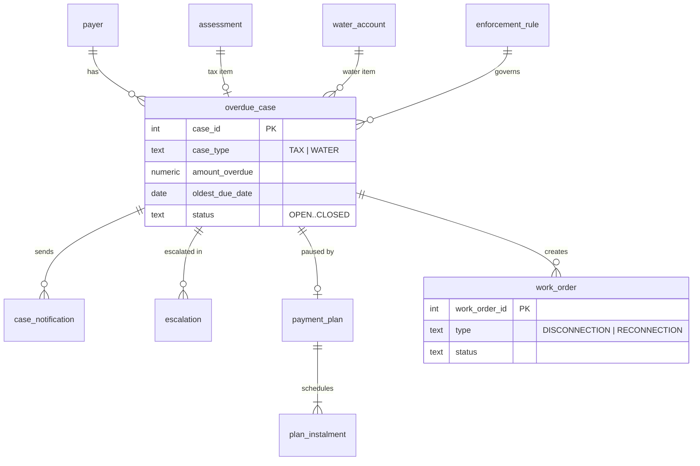
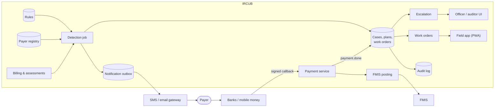

# Part 3 · Business Analysis & System Design: Compliance & Enforcement module

A design (not built) that plugs into the existing IRCUB registry, billing, payments, notifications, audit log and worker.

## 3.1 Functional requirements

| ID    | Requirement                                                                                                                                                               |
| ----- | ------------------------------------------------------------------------------------------------------------------------------------------------------------------------- |
| FR-01 | Daily job flags unpaid tax assessments and water arrears **> 60 days** past due (configurable); one case per item, re-runs never duplicate.                               |
| FR-02 | Items with an active payment plan, dispute or hold are skipped (enforcement paused).                                                                                      |
| FR-03 | New case → **SMS + email** with amount, **control number** and a **secure payment link** (signed, single-item, expires in 14 days). Reminders on a configurable schedule. |
| FR-04 | Tax case unpaid at **90 days** → **escalated** to a compliance officer and visible to auditors.                                                                           |
| FR-05 | Officers add notes, contact attempts, holds, and propose payment plans; auditors have read-only access to the full history.                                               |
| FR-06 | Water case → disconnection notice; after the configurable **notice period** a **disconnection work order** is created.                                                    |
| FR-07 | Field officers close work orders (completed with reading/photo/GPS, or not done with a reason). Full payment after disconnection → **reconnection** work order.           |
| FR-08 | Payment plans need supervisor approval (creator ≠ approver); an active plan **pauses** enforcement; a missed instalment resumes it.                                       |
| FR-09 | A payment from any channel closes the case and **cancels open work orders** immediately.                                                                                  |
| FR-10 | Admins configure rules per revenue type / tariff class (days, notice period, reminders, templates); versioned and audited.                                                |
| FR-11 | Reports: overdue ageing, cases by status/officer, recovery rate, work orders, plans.                                                                                      |

## 3.2 Non-functional requirements

| Area         | Requirement                                                                                                                                                         |
| ------------ | ------------------------------------------------------------------------------------------------------------------------------------------------------------------- |
| Security     | RBAC with new permissions (`compliance.view/manage`, `plans.approve`, `workorders.manage`, `compliance.rules.manage`); 2FA for staff; signed expiring links; HTTPS. |
| Auditability | Every change in the hash-chained audit log with before/after values; nothing hard-deleted.                                                                          |
| Privacy      | Minimum data in messages; masked phone/ID in lists; access to personal data logged; retention policy.                                                               |
| Correctness  | Idempotent jobs (unique keys); a payment always wins over enforcement (status re-checked before disconnection).                                                     |
| Performance  | Daily job handles 1M open items in < 15 min; screens < 2 s (p95).                                                                                                   |
| Availability | 99.5% staff screens; 99.9% payment link and callbacks.                                                                                                              |
| Reliability  | Outbox for messages with retries; jobs resumable after a crash.                                                                                                     |
| Usability    | Field app works on a phone and offline; Somali and English.                                                                                                         |

## 3.3 Assumptions and scope

**Assumptions:** age counts from the due date (oldest unpaid bill for water); payers have a phone or email (else manual contact); existing SMS/email gateways and payment channels are reused; disconnection is done physically by Water Agency staff; legal action after escalation happens outside IRCUB.

**Out of scope:** penalty waivers and write-offs, court case management, debt collectors, credit bureaus, smart-meter remote shut-off, route optimisation, a native mobile app (a PWA instead), FMIS changes (enforcement creates no journal entries).

## 3.4 Data model



```sql
CREATE TABLE enforcement_rule (
  rule_id serial PRIMARY KEY, scope text NOT NULL,            -- 'TAX:BL', 'WATER:DOMESTIC'
  flag_after_days int NOT NULL DEFAULT 60, escalate_after_days int NOT NULL DEFAULT 90,
  notice_period_days int NOT NULL DEFAULT 14, reminder_days jsonb NOT NULL DEFAULT '[60,75,85]',
  version int NOT NULL DEFAULT 1, is_active boolean NOT NULL DEFAULT true,
  CHECK (escalate_after_days >= flag_after_days), UNIQUE (scope, version));

CREATE TABLE overdue_case (
  case_id serial PRIMARY KEY, case_type text NOT NULL CHECK (case_type IN ('TAX','WATER')),
  payer_id int NOT NULL REFERENCES payer, assessment_id int REFERENCES assessment,
  account_no text REFERENCES water_account, rule_id int NOT NULL REFERENCES enforcement_rule,
  amount_overdue numeric(14,2) NOT NULL, oldest_due_date date NOT NULL,
  status text NOT NULL DEFAULT 'OPEN', pause_reason text, close_reason text,
  opened_at timestamptz NOT NULL DEFAULT now(), closed_at timestamptz);
-- One open case per item: makes the daily job idempotent.
CREATE UNIQUE INDEX ON overdue_case (assessment_id) WHERE status <> 'CLOSED';
CREATE UNIQUE INDEX ON overdue_case (account_no)    WHERE status <> 'CLOSED';

CREATE TABLE case_notification (
  id serial PRIMARY KEY, case_id int NOT NULL REFERENCES overdue_case,
  notification_id int NOT NULL REFERENCES notification, kind text NOT NULL,
  reminder_day int, link_token_hash text, link_expires_at timestamptz,
  UNIQUE (case_id, kind, reminder_day));                        -- never the same reminder twice

CREATE TABLE escalation (
  escalation_id serial PRIMARY KEY, case_id int NOT NULL REFERENCES overdue_case,
  level text NOT NULL, assigned_to int REFERENCES app_user, status text NOT NULL DEFAULT 'OPEN',
  follow_up_on date, UNIQUE (case_id, level));

CREATE TABLE payment_plan (
  plan_id serial PRIMARY KEY, case_id int NOT NULL REFERENCES overdue_case,
  total_amount numeric(14,2) NOT NULL, status text NOT NULL DEFAULT 'PROPOSED',
  created_by int NOT NULL REFERENCES app_user, approved_by int REFERENCES app_user,
  CHECK (approved_by IS NULL OR approved_by <> created_by));    -- four-eyes

CREATE TABLE plan_instalment (
  instalment_id serial PRIMARY KEY, plan_id int NOT NULL REFERENCES payment_plan,
  due_date date NOT NULL, amount numeric(14,2) NOT NULL, amount_paid numeric(14,2) DEFAULT 0,
  status text NOT NULL DEFAULT 'DUE', UNIQUE (plan_id, due_date));

CREATE TABLE work_order (
  work_order_id serial PRIMARY KEY, case_id int REFERENCES overdue_case,
  account_no text NOT NULL REFERENCES water_account, type text NOT NULL,
  status text NOT NULL DEFAULT 'PENDING', assigned_to int REFERENCES app_user,
  closed_at timestamptz, outcome_reason text, meter_reading int, photo_url text, gps point);
CREATE UNIQUE INDEX ON work_order (account_no, type) WHERE status IN ('PENDING','ASSIGNED');
```

## 3.5 User stories

**1. Payer receiving an overdue notification** — _As a payer with an overdue balance, I want an SMS and email with what I owe, the reference and a secure link, so that I can pay quickly and avoid enforcement._

- **Given** my bill is 61 days overdue, **when** the daily job runs, **then** I get one SMS and one email with amount, control number and a 14-day payment link.
- **Given** I open the link, **when** it loads, **then** I see only that item and can pay by mobile money, without logging in.
- **Given** the link has expired, **when** I open it, **then** I see "expired" and office contacts, and no data.
- **Given** I paid in full, **when** the payment is processed, **then** my case closes and reminders stop.

**2. Auditor reviewing escalated cases** — _As an auditor, I want a read-only list of escalated cases with full history, so that I can check enforcement followed the rules._

- **Given** I am an auditor, **when** I open _Escalated cases_, **then** I can filter by type, officer, date and amount.
- **Given** I open a case, **when** it loads, **then** I see every notification, escalation, note, hold, plan and payment with who/when and before/after values.
- **Given** any case, **when** I try to change it, **then** there are no edit buttons and the API returns 403.

**3. Administrator configuring rules** — _As an administrator, I want to set flag, reminder, escalation and notice periods per revenue type and tariff class, so that policy changes need no release._

- **Given** I change `TAX:BL` to flag at 45 days, **when** I save, **then** a new version is stored and audited.
- **Given** escalate-after is smaller than flag-after, **when** I save, **then** I get a validation error.
- **Given** a rule changed today, **when** the next job runs, **then** new cases use it and existing cases keep their version.

**4. Field officer closing a work order** — _As a water field officer, I want my work orders on my phone and to close them with evidence, so that disconnections and reconnections are correct and recorded._

- **Given** an assigned disconnection, **when** I check status on site, **then** I see if the customer has paid; if so, the order shows _Cancelled — paid_.
- **Given** I disconnect, **when** I enter the reading and photo and tap _Complete_, **then** the order is COMPLETED and the account DISCONNECTED.
- **Given** I could not do the work, **when** I choose _Not done_, **then** I must pick a reason.
- **Given** a disconnected customer pays in full, **when** the payment is processed, **then** a reconnection order is created.

## 3.6 Architecture



## 3.7 End-to-end flow: mobile money payment → FMIS → work order cancelled

1. Customer with a disconnection notice pays the full balance by mobile money, quoting the bill control number (or via the secure link).
2. The provider sends a **signed callback** to `/api/payments/callback`.
3. IRCUB verifies the HMAC signature, the 5-minute timestamp window and the idempotency key.
4. It validates the control number (check digit) and amount, converts currency, stores the payment as PENDING (unique `external_ref`) and queues it.
5. The worker claims it (`SKIP LOCKED`), applies it to the bill (PAID) and marks it DONE in one transaction, with an audit record.
6. A `payment.done` event reaches the compliance module: balance is 0 → the case closes (`PAID`).
7. The open disconnection work order is **cancelled** and removed from the field officer's list.
8. The customer gets a confirmation SMS.
9. That night the FMIS job posts the balanced journal (debit bank GL, credit water GL), stores the FMIS reference, retries up to 3 times on failure.
10. Next day, channel and FMIS reconciliations confirm the payment end to end.
