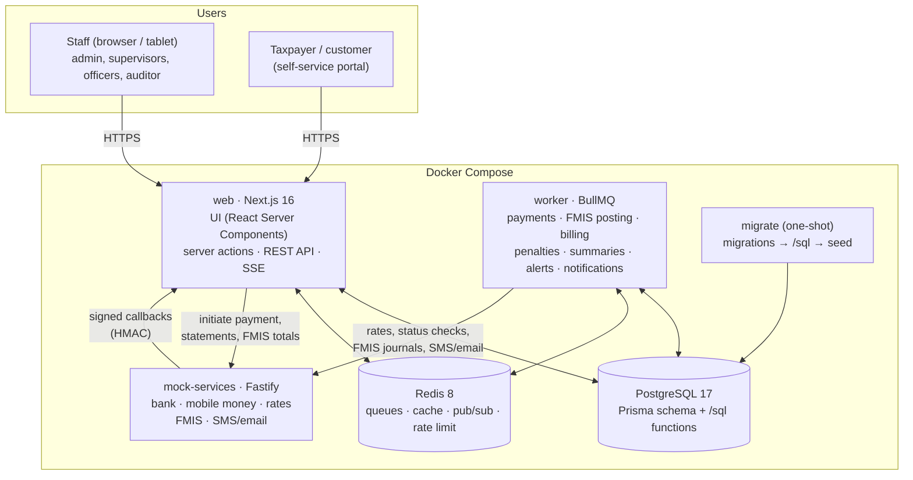
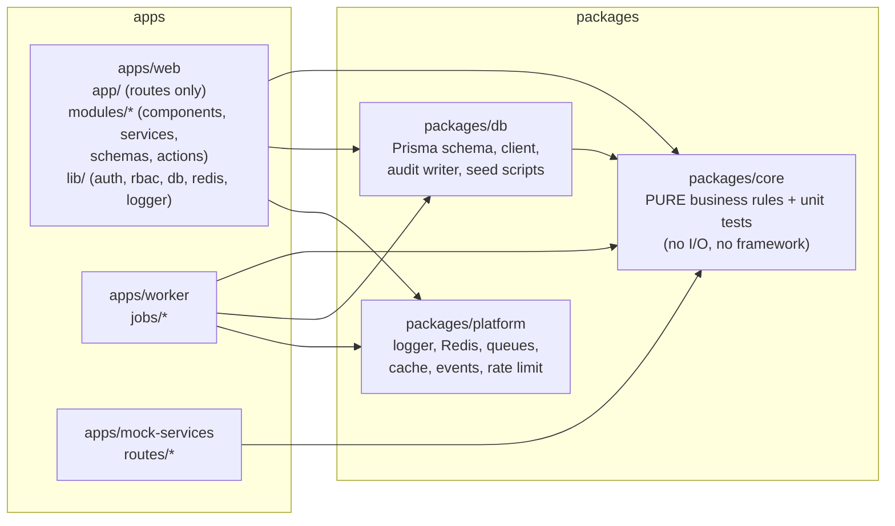
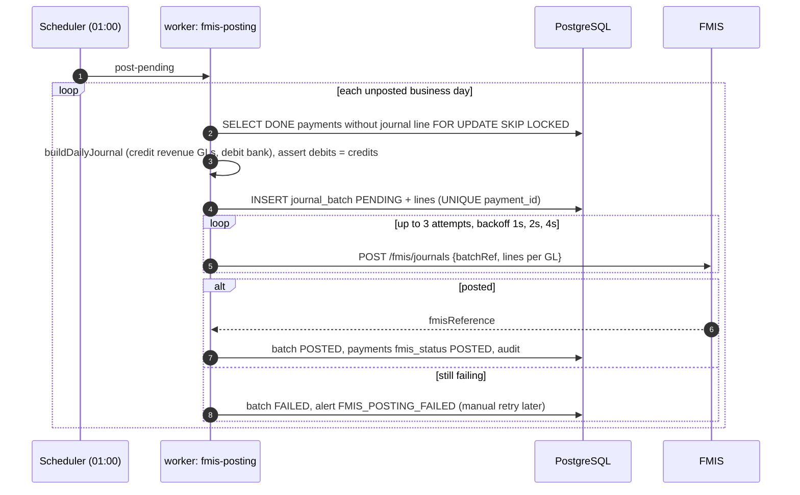
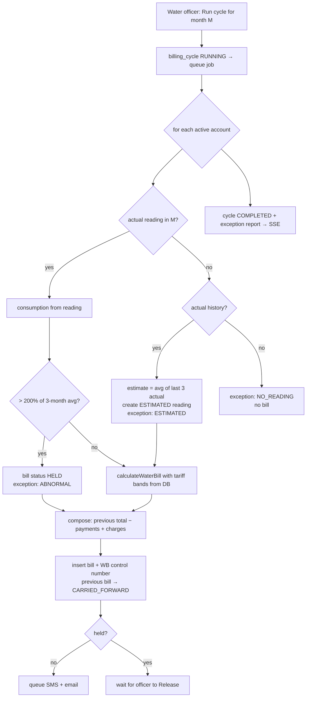
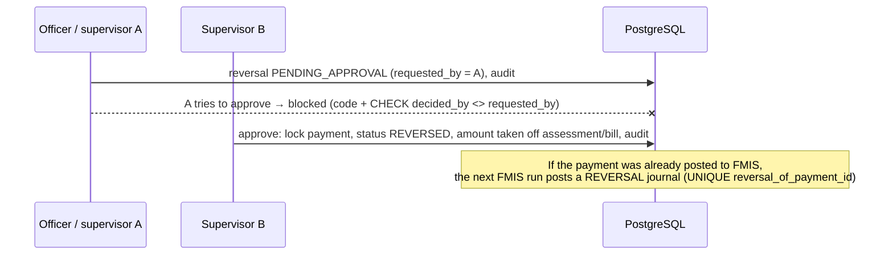

# Architecture

## 1. System context and containers



## 2. Code structure



**Rules that keep it explainable**

- **Business logic lives in `packages/core`** as small pure functions (tariff, penalty, validation, HMAC, journals, forecast …). Web and worker both call it, so each rule exists once and is unit tested without a database.
- **Thin entry points:** every API route, server action and page follows _authenticate → authorise → validate (Zod) → call a service → respond_. The permission check is one shared guard (`apps/web/src/lib/rbac.ts`).
- **Money in integer cents** in TypeScript, `NUMERIC(14,2)` in PostgreSQL.
- **The database enforces the invariants** that matter most (unique references, balanced journals, four-eyes, append-only audit), so a bug in application code cannot break them silently.

## 3. Technology choices

| Choice                                  | Why                                                                                                                                                     | Trade-off                                                                                                  |
| --------------------------------------- | ------------------------------------------------------------------------------------------------------------------------------------------------------- | ---------------------------------------------------------------------------------------------------------- |
| **TypeScript everywhere**               | One language for UI, API, worker, tests; types shared end to end (Zod schemas used by both form and server).                                            | Node is single-threaded — CPU-heavy work goes to the worker.                                               |
| **Next.js 16 App Router**               | Server components read the database directly (fast pages, little client JS); server actions for forms; route handlers for partner APIs; one deployable. | Framework conventions change quickly (e.g. `middleware` → `proxy` in v16).                                 |
| **PostgreSQL 17**                       | Transactions, `SELECT … FOR UPDATE SKIP LOCKED`, window functions, partial / covering / BRIN indexes, partitioning, PL/pgSQL, JSONB.                    | Needs tuning and partitioning at 50M+ rows (designed for in `/sql/02`).                                    |
| **Prisma 7**                            | Typed queries, migrations, readable schema; raw SQL where needed (window functions, locking, the penalty function).                                     | Some features (partitioning, CHECK constraints) must be written in SQL migrations.                         |
| **Redis + BullMQ**                      | Durable queues with retries, backoff and job-id dedupe; the same Redis gives cache, pub/sub for SSE and rate limiting.                                  | One more service to operate; queue state is not the source of truth (the database is).                     |
| **Server-Sent Events**                  | Updates flow one way (server → browser); plain HTTP, auto-reconnect, works through proxies.                                                             | No browser → server messages (not needed).                                                                 |
| **Auth.js credentials + argon2 + TOTP** | Standard session handling and CSRF protection; strong password hashing; optional 2FA.                                                                   | Credentials provider requires JWT sessions, so permissions are re-checked in the database on each request. |
| **Docker Compose**                      | One command brings up the whole system with data.                                                                                                       | Production would use an orchestrator (Kubernetes / ECS) and managed PostgreSQL/Redis.                      |

## 4. Key flows

### 4.1 Payment notification (callback) → processing → live update

```mermaid
sequenceDiagram
    autonumber
    participant CH as Bank / mobile money
    participant API as web: /api/payments/callback
    participant DB as PostgreSQL
    participant Q as Redis (BullMQ)
    participant W as worker
    participant UI as Browser (SSE)
    CH->>API: POST + X-Timestamp, X-Signature, Idempotency-Key
    API->>API: rate limit, verify HMAC (timingSafeEqual), 5-minute window
    API->>DB: claim idempotency key (INSERT … ON CONFLICT DO NOTHING)
    API->>DB: validate (payer, revenue code, unique ref), convert currency
    API->>DB: INSERT payment PENDING / INSERT rejected_payment
    API->>Q: add job payment-{id} (per-category queue)
    API-->>CH: 200 {received, accepted, rejected, errors}
    Q->>W: job
    W->>DB: UPDATE … SET PROCESSING WHERE id IN (SELECT … FOR UPDATE SKIP LOCKED)
    W->>DB: BEGIN; lock assessment/bill; apply; SET DONE WHERE PROCESSING; audit; COMMIT
    W->>Q: invalidate summary:{code}:{date}; schedule daily_summary refresh
    W-->>UI: publish payment.updated → SSE
```

### 4.2 Nightly FMIS posting with retries



### 4.3 Monthly water billing cycle



### 4.4 Reversal with segregation of duties



## 5. No double processing — the guarantees in one place

| Layer          | Guarantee                                                                                                                                                     |
| -------------- | ------------------------------------------------------------------------------------------------------------------------------------------------------------- |
| API            | `Idempotency-Key` claimed first; replay returns the stored response.                                                                                          |
| Database       | `UNIQUE (external_ref)` — a channel payment can be stored once.                                                                                               |
| Queue          | Job id `payment-{id}` — duplicate jobs are ignored while the first exists.                                                                                    |
| Worker         | Claim with `FOR UPDATE SKIP LOCKED` only `WHERE status = 'PENDING'`; apply + `DONE` in one transaction `WHERE status = 'PROCESSING'`.                         |
| Crash recovery | Rows stuck in `PROCESSING` > 5 min go back to `PENDING` (safe: DONE was never committed); old `PENDING` rows are re-queued.                                   |
| FMIS           | Only payments without a journal line are selected (`FOR UPDATE SKIP LOCKED`); `UNIQUE (payment_id)` on `journal_line`; FMIS dedupes on `IRCUB-JB-{batch_id}`. |

## 6. Scaling to 50 million payments

- Web is stateless → run several containers behind a load balancer (sessions are JWT; SSE fans out through Redis pub/sub).
- Workers scale horizontally; per-category queues isolate tax from water peaks; concurrency is an environment variable.
- Reporting never scans `payment`: covering partial index + BRIN for range queries, `daily_summary` for dashboards, Redis cache for live day summaries.
- Monthly partitioning of `payment` (DDL in `sql/02-indexes-and-partitioning.sql`) when the table grows past what indexes handle comfortably; old partitions archived.
- PostgreSQL: connection pooling (PgBouncer), read replica for reports, managed backups with point-in-time recovery.
