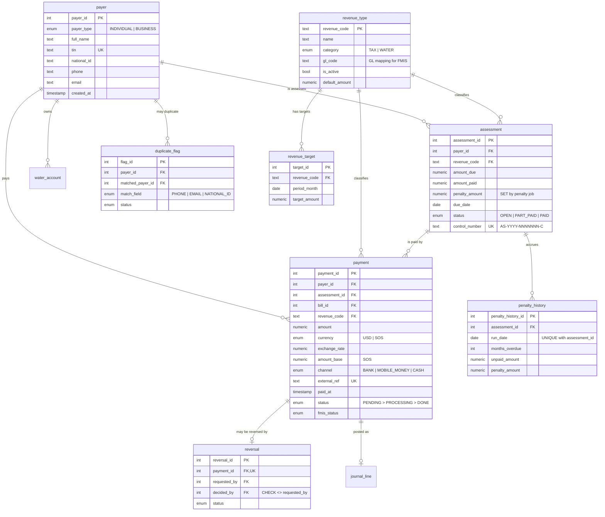
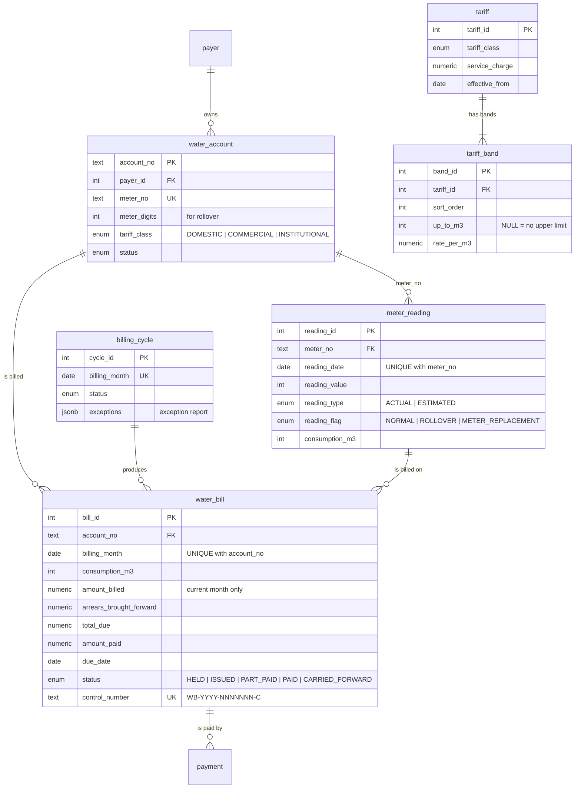

# Entity Relationship Diagram

Source of truth: [`packages/db/prisma/schema.prisma`](../packages/db/prisma/schema.prisma) plus the raw SQL constraints in
[`packages/db/prisma/migrations/20260928000100_constraints_and_guards`](../packages/db/prisma/migrations/20260928000100_constraints_and_guards/migration.sql).
Tables from the brief are `payer`, `revenue_type`, `assessment`, `payment`, `water_account` and `meter_reading`; every other table is an addition explained in [`answers/00-assumptions.md`](../answers/00-assumptions.md#c-schema-additions-to-the-briefs-tables).

The diagram is split into three views so it stays readable.

## 1. Registry, revenue and payments

## 2. Water utility

## 3. Security, FMIS, reporting and integration

```mermaid
erDiagram
    app_user ||--o{ user_role : "has"
    role ||--o{ user_role : "granted to"
    role ||--o{ role_permission : "has"
    permission ||--o{ role_permission : "granted by"
    role ||--o{ role : "parent of"
    app_user ||--o{ audit_log : "acts in"
    app_user |o--o| payer : "self-service link"
    journal_batch ||--|{ journal_line : "contains"
    payment ||--o| journal_line : "UNIQUE payment_id"

    app_user {
        int user_id PK
        text email UK
        text password_hash "argon2id"
        bool is_active
        bool totp_enabled
        int failed_login_count
        timestamp locked_until
        int payer_id FK,UK
    }
    role {
        int role_id PK
        text code UK
        int parent_role_id FK "hierarchy"
        bool is_system
    }
    permission {
        int permission_id PK
        text code UK
        text module
    }
    audit_log {
        int audit_id PK
        timestamp occurred_at
        int actor_user_id FK
        text action
        text entity_type
        text entity_id
        jsonb before
        jsonb after
        text prev_hash
        text hash UK "SHA256(prev_hash + row)"
    }
    journal_batch {
        int batch_id PK
        date business_date
        enum status "PENDING | POSTED | FAILED | REVERSED"
        numeric total_debit "CHECK = total_credit"
        numeric total_credit
        text fmis_reference UK
        int attempts
    }
    journal_line {
        int line_id PK
        int batch_id FK
        int payment_id FK,UK
        text gl_code
        numeric debit
        numeric credit
    }
    daily_summary {
        date summary_date PK
        text revenue_code PK
        enum channel PK
        int payment_count
        numeric total_amount_base
        int reversal_count
    }
    alert {
        int alert_id PK
        enum alert_type
        enum severity
        text dedupe_key UK
    }
    exchange_rate {
        int rate_id PK
        enum currency
        numeric rate_to_base
        timestamp fetched_at
    }
    idempotency_key {
        text key PK
        text request_hash
        int response_status
        jsonb response_body
    }
    rejected_payment {
        int rejected_id PK
        enum source
        int row_number
        text external_ref
        jsonb payload
        text reason
    }
    channel_statement_line {
        int line_id PK
        enum channel
        date statement_date
        text external_ref
        numeric amount
        enum match_status
    }
    notification {
        int notification_id PK
        enum channel "SMS | EMAIL"
        text recipient
        enum status
    }
    system_config {
        text key PK
        jsonb value
    }
```

## Integrity rules enforced by the database

| Rule                                                          | How                                                                                                    |
| ------------------------------------------------------------- | ------------------------------------------------------------------------------------------------------ |
| TIN is unique                                                 | `UNIQUE (tin)`                                                                                         |
| A channel reference is only ever received once                | `UNIQUE (external_ref)` on `payment`                                                                   |
| A payment is posted to FMIS at most once                      | `UNIQUE (payment_id)` on `journal_line`                                                                |
| One penalty history row per assessment per day                | `UNIQUE (assessment_id, run_date)`                                                                     |
| One bill per account per month; one reading per meter per day | `UNIQUE (account_no, billing_month)`, `UNIQUE (meter_no, reading_date)`                                |
| Requester cannot approve their own reversal                   | `CHECK (decided_by IS NULL OR decided_by <> requested_by)`                                             |
| Journals balance                                              | `CHECK (total_debit = total_credit)`; each line is debit **or** credit                                 |
| Positive money                                                | `CHECK (amount > 0 AND amount_base > 0)`, `CHECK (amount_due > 0 ...)`, `penalty_amount <= amount_due` |
| Audit log is append-only                                      | `BEFORE UPDATE OR DELETE` and `BEFORE TRUNCATE` triggers raise an error                                |
